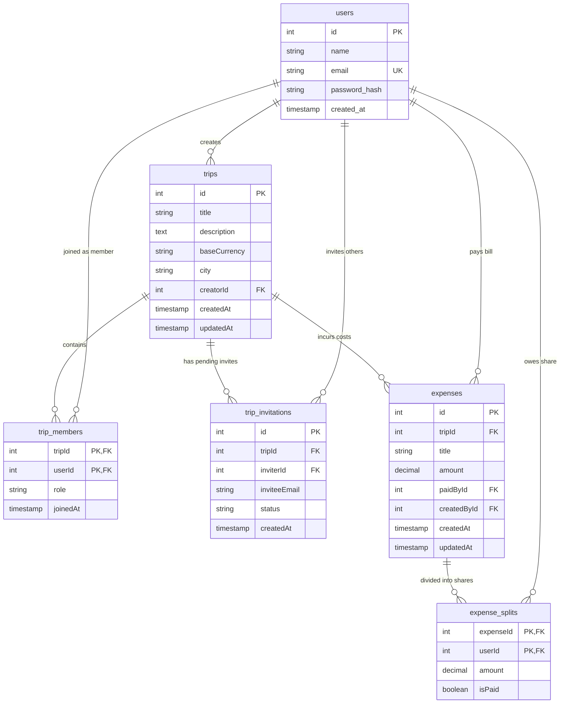

# ✈️ Split It Right — Travel Expense Splitting Web App

**Split It Right** is a premium full-stack web application designed to help travelers split bills, manage trip itineraries, and track shared expenses with ease. From setting up trips in different base currencies to inviting friends and settlement status tracking, **Split It Right** keeps your travel group finances clean and transparent.

---

## ✨ Features

*   **🔒 Secure Authentication**: User registration and login utilizing JWT authentication and `bcryptjs` password hashing.
*   **🗺️ Trip Planner & City Select**: Manage active trips with custom base currencies (e.g., SAR, EUR, USD). Features a searchable **Nominatim OpenStreetMap API** city selector.
*   **👥 Real-Time Group Collaboration**: Creator/admin dashboard to invite members via email, with dedicated user interfaces to accept or reject pending invitations.
*   **💸 Smart Expense Division**:
    *   Create splits for any expense and select the total amount.
    *   Select custom participants (check/uncheck trip members).
    *   **Live Share Calculator**: Recalculates exact individual splits dynamically in the modal.
    *   Payer customization (assigning any trip member as the payer).
*   **📊 Premium Finances Dashboard**:
    *   *Total Expenses*: Total combined group spending in the trip's base currency.
    *   *You Paid*: Sum of bills you personally settled out of pocket.
    *   *You Owe*: Amount you owe to other trip members for splits they paid.
    *   *You are Owed*: Total outstanding amount other members still owe you.
*   **🔄 Interactive Status Settlement**: Expand any transaction to see participants, and click status badges to mark individual shares as `Paid` or `Unpaid` instantly.
*   **🐳 Multi-Container Docker Setup**: Run the entire microservice ecosystem (React, Express, PostgreSQL, and pgAdmin) with a single command.

---

## 📁 Project Structure

*   `client/` — **React Frontend** powered by Vite, TailwindCSS, and Radix UI primitives.
*   `server/` — **ExpressJS Restful API** powered by Prisma ORM and PostgreSQL.
*   `db/` — SQL database schemas and initial bootstrap scripts.
*   `nginx/` — Reverse proxy server configurations.
*   `docker-compose.yml` — Multi-container docker specifications for development.

---

## 🚀 Getting Started

### 📋 Prerequisites
*   [Node.js](https://nodejs.org/) (v20+ recommended)
*   [Docker Desktop](https://www.docker.com/products/docker-desktop/) (Optional, but recommended)

---

### Method A: Run with Docker Compose (Recommended)

1.  **Configure Environment Variables**:
    Copy the main `.env.example` file to `.env`:
    ```bash
    cp example.env .env
    ```

2.  **Spin Up the Services**:
    Build and launch all services (`client`, `server`, `db`, and `pgadmin`):
    ```bash
    docker compose up --build
    ```
    *   **Frontend Client**: [http://localhost:3000](http://localhost:3000)
    *   **Backend Server Docs**: [http://localhost:4000/v1/api/docs](http://localhost:4000/v1/api/docs)
    *   **pgAdmin Interface**: [http://localhost:5050](http://localhost:5050) (auto-logins to manage tables)

3.  **Tear Down**:
    ```bash
    docker compose down -v
    ```

---

### Method B: Manual Local Development

If you prefer to run services bare-metal on your host machine:

#### 1. Configure Local Environment
Ensure you create local `.env` files matching the templates in both folders:
*   Frontend: `client/.env` (Define `VITE_API_URL=http://localhost:4000/v1/api`)
*   Backend: `server/.env` (Define `DATABASE_URL`, `JWT_SECRET`, etc.)

#### 2. Start the Backend API
```bash
cd server
npm install
npx prisma db push      # Sync database schema to your local PostgreSQL instance
npx prisma generate     # Regenerate Prisma Client
npm run dev             # Starts express server on http://localhost:4000
```

#### 3. Start the Frontend Client
```bash
cd client
npm install
npm run dev             # Starts Vite hot-reload server on http://localhost:3000
```

---

## 🛠️ Database & Schema Management

This project uses **Prisma ORM** for standard-compliant relational modeling. 

### 1. Schema Sync
Whenever you update `server/prisma/schema.prisma`, sync the tables:
```bash
cd server
npx prisma db push
```

### 2. Regenerate Client
Generate matching Typescript/Javascript types for database queries:
```bash
cd server
npx prisma generate
```

### 3. Database GUI (Prisma Studio)
Inspect tables and edit rows in a clean local browser GUI:
```bash
cd server
npx prisma studio
```

---

## 🗄️ Relational Database Schema

The database relies on PostgreSQL. Below is the Entity-Relationship (ER) diagram representing the structure of the database tables and their constraints:



The corresponding DDL SQL bootstrap script is saved in [db/init.sql](file:///c:/Users/403/Documents/cpit405project/db/init.sql) and is loaded automatically during Docker database startup.
